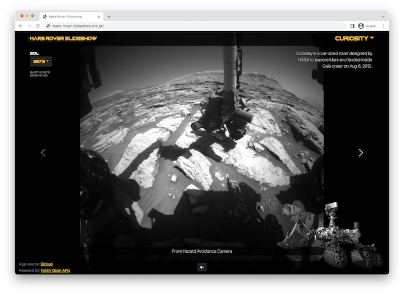

# Mars Rover Slideshow

Web application build using the [Spring Framework](https://spring.io/),
providing slideshows with images gathered by NASA's Curiosity,
Opportunity, and Spirit rovers on Mars, more information about the
exploration programs available [here](https://mars.nasa.gov/mer/).

[Live App](http://mars-rover-slideshow.nrc.pt/)

## Preview

    

## Run Locally

Clone the repository and inside the directory run:

    $ ./gradlew bootRun

## Acknowledgements

* Photos and data powered by: [NASA Open APIs](https://api.nasa.gov/).
* Thank you [Trevor Page](https://www.udemy.com/user/trevorpage/) for the inspiration.

